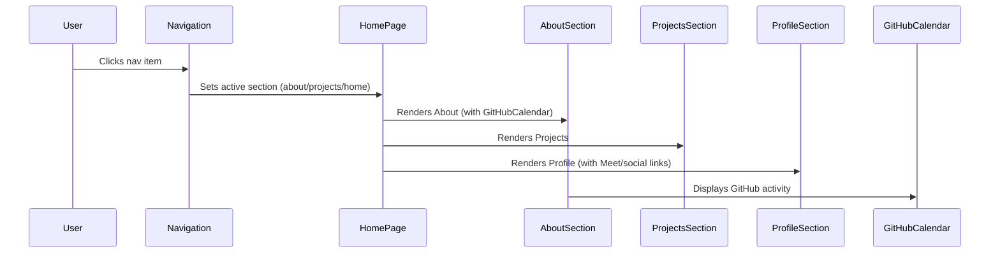

# Images

<!-- This is an auto-generated comment: release notes by coderabbit.ai -->

## Summary by CodeRabbit

- **Removed Features**
  - Removed the Contact and Digital Goods sections, including their navigation items and pages.
  - Deleted related animation components and their configuration files.
  - Removed the testimonials section in favor of a dynamic GitHub contribution calendar.

- **Enhancements**
  - Improved the About and Profile sections with updated content, new social and scheduling links, and refreshed service offerings.
  - Enhanced project details with richer metadata, technology icons, and improved UI for project pages.

- **User Interface Updates**
  - Updated navigation logic for more accurate active section highlighting.
  - Refined project and animation interactions for smoother visual effects.

- **Dependencies**
  - Added GitHub contribution calendar and icon libraries.

- **Other**
  - Updated development server to run on port 5050.

<!-- end of auto-generated comment: release notes by coderabbit.ai -->

## Conversation

### 2025-06-24T13:22:02Z · vercel[bot] (bot)

[vc]: #Fx5cxfWcaiCdXc/MKZXXkqleAbfUF49xiyJi9c2NC+0=:eyJpc01vbm9yZXBvIjp0cnVlLCJ0eXBlIjoiZ2l0aHViIiwicHJvamVjdHMiOlt7Im5hbWUiOiJob21lcGFnZSIsImluc3BlY3RvclVybCI6Imh0dHBzOi8vdmVyY2VsLmNvbS90aG9tYXMtcHJvamVjdHMtODI1YWU2NjkvaG9tZXBhZ2UvNUxVQjdyU0M0RzlSdGU4VGlaMWQ5QXdOOVc3USIsInByZXZpZXdVcmwiOiIiLCJuZXh0Q29tbWl0U3RhdHVzIjoiRkFJTEVEIiwibGl2ZUZlZWRiYWNrIjp7InJlc29sdmVkIjowLCJ1bnJlc29sdmVkIjowLCJ0b3RhbCI6MCwibGluayI6IiJ9LCJyb290RGlyZWN0b3J5IjpudWxsfV19
**The latest updates on your projects**. Learn more about [Vercel for Git ↗︎](https://vercel.link/github-learn-more)

| Name | Status | Preview | Comments | Updated (UTC) |
| :--- | :----- | :------ | :------- | :------ |
| **homepage** | ❌ Failed ([Inspect](https://vercel.com/thomas-projects-825ae669/homepage/5LUB7rSC4G9Rte8TiZ1d9AwN9W7Q)) |  |  | Jun 24, 2025 1:22pm |

### 2025-06-24T13:22:13Z · coderabbitai[bot] (bot)

<!-- This is an auto-generated comment: summarize by coderabbit.ai -->
<!-- This is an auto-generated comment: failure by coderabbit.ai -->

> [!CAUTION]
> ## Review failed
> 
> The pull request is closed.

<!-- end of auto-generated comment: failure by coderabbit.ai -->
<!-- walkthrough_start -->

## Walkthrough

This change removes the digital goods and contact sections and their associated pages, components, and navigation items. It eliminates custom animation components and related animation assets. The project and about sections are refactored for improved structure, flexible metadata, and enhanced UI. Navigation logic is streamlined, and new dependencies are added for GitHub activity visualization.

## Changes

| Files/Paths                                               | Change Summary                                                                                                    |
|-----------------------------------------------------------|------------------------------------------------------------------------------------------------------------------|
| app/contact/page.tsx, app/digital-goods/page.tsx       | Deleted pages for Contact and Digital Goods.                                                                     |
| components/contact-section.tsx, components/digital-goods-section.tsx | Removed Contact and Digital Goods section components.                                                            |
| components/animations/appear.js, components/animations/hero.js | Deleted custom animation components.                                                                             |
| public/animations/appear.json, public/animations/hero.json | Deleted animation configuration assets.                                                                          |
| app/page.tsx                                              | Removed all logic and rendering for Digital Goods and Contact sections from the homepage.                        |
| components/navigation.tsx                                 | Removed Digital Goods and Contact nav items; refactored active section logic and state management.               |
| components/profile-section.tsx                            | Replaced contact button with external "Meet" link; added social icons; updated service cards and descriptions.   |
| components/about-section.tsx                              | Updated contact info, added "Meet" button, restyled sections, replaced testimonials with GitHub calendar, etc.   |
| components/animated-project.tsx, components/project.tsx | Simplified animation logic; removed hover image scaling; enhanced project title animation.                       |
| components/projects-section.tsx                           | Changed heading text; simplified condition for animated projects.                                                |
| components/project-detail.tsx                             | Unified project details into flexible structure; simplified animation logic; improved tech stack UI.             |
| app/projects/[slug]/client-wrapper.tsx                    | Refactored ProjectData interface: replaced fields with flexible details array; allowed null animationComponent.  |
| app/projects/[slug]/page.tsx                              | Made ProjectPage async; updated params typing; removed local ProjectData interface.                              |
| lib/projects-data.ts                                      | Rewrote project data with detailed descriptions and structured details array; updated images and animation flags. |
| package.json                                              | Added `react-github-calendar` and `react-icons` dependencies; set dev port to 5050.                             |

## Sequence Diagram(s)

## Poem

> A rabbit hopped and swept the floor,  
> Out went contact, goods, and more!  
> Animations packed away,  
> Projects now have much to say.  
> GitHub tracks my leaps and bounds,  
> With shiny icons all around.  
> Onward, code—let’s dig new ground! 🐇✨

<!-- walkthrough_end -->
<!-- internal state start -->

<!-- FAHghAtBAEAqAWBLAztF0CGA7TBXALgPYQDmAplmQE4b5kAm0AxoQLasX4Bc0NA7tGS52GKgE9oAIwkt61DJMmJ8AOgyJoUAHzBd4KLowAHIwHoWWfBib5TRjORX5kADy7AARF+ABiH9ABBAElSCnk6RiERcWhCADNmeGxyZF0EMmg5ABsyCOg4xBzMsgLKRgxoACUya3x83CwbREIsDCzmNiMWzmhWjkYAAwBhFqsbAAUHMgHofCS6qgo5RfKOy1rBMiaW6D5lJBwK+3JoLIwxQgIVaCC6xFYuqjz8PkIOh+7LZB4Ks4uCXY0EzUTBYVYWMZ1ZBbfDNLDXdLvLqUSy8XK4KhlaAAKQAygANWbzQHGIwMIkZYajWq4mFwmYsD4ou5YZCIOQU6ADSbkAAy50u+AZnU++AANNAjFRCAA3dmILAkTCCfBUXA2DHk44ZPZzNZs5B0VF/QWg1ZyeiIJi0ckQjYKuhUOLWMgI+DUHUYVBYN4YeiW2EtNqnQgkK0Sw026CsbBTDiWCWEKjQajS5NJMFZBVKqVkaGohWcxnIzgqXS6PyBLKO2hw1BETlyJhnGiB1mxBJkFyPPJJyW4SRZpgpyzKRB53QwACi3aTeTkztw1fqjTbXJG6wmUwAFABKGaLViy8lxaWsLmk8zUmx2KZOVwDTzeYBQCCGEymS1hqxZUiEQj0Mgt6OM4bhPh4vj+MEoSUK25JRDGMTxIkyQTsAiLZLkJ6FBkC4KuSFTVBscQNNsrTtMWoq9Bg/RcgAIog35tAA4v+gE8tMbroJRzJomCHqrNqpwCgC0gkiY2bKgMDFMVkrEAcgtJkcKTI9AqbIchU3JTPy/xCkiopuhkPE9HwXqNiUGBLnUXY9h2nJHvQS6unA7qLLs5k+pg/pjkG7RZKG4YqlGMatOQ8birEyapn2Gb0Fmiq7PshZzNxIrMgA3GgUL3EYWQSIs+AYliFR4oSqpkDq+yci8byUIatrpZwyBluWlYBNW4R1rMbxzLhWwtrWLSoMhtlzuSfZGAOQ4jrCsJoTAdFkDk86WdZKazk8J6kWuJmotJjHKCxbHIBxe4zIWAyXl+R2/iQJ3Aa6oGPl4EEvgYwCXtq95ga9kGBCE5CwTakTCIhEjIUwGYpGk7ooYqeZokeMoZG07SLHEHqNIj2CMIs/FUJJAVhsOixnM8vVwwdsnyYBSltjMuPrte+D0/SBnMqgp5sJyAwABJsGQHEqSWljXCMVCLMgyKWoq+USn1aAfE8XN9n10KzK8HPNZg7mYRERlrAGcLBvjyySYOhBMAA1vkatwx4N0/n+CkeJgTQo5sZFoKgjIRRNAKcIgZNiBKlrIAoCVKnMtBe22ADkqDh3l5yGx4do2G70JkYnRu+eRfHm4lls2z79RZPlSPHvQ1wBD5bZo6HnJJodBdub6WD3ENOAp0wZDwIQWTLO8EVmpkiAymgrLshkiseAPHBZ3SOyiBkh7V4bUt1MhitCYaaoaosEoKs2uCy0qrRyiQ3dj4QfXJtnbaoNu8+Cx4EoeAogrv9AHhSoQAArGEyAPC7glIedQ7ZSLQwYNcAAcm8O+bkQwkyisFOg0ZYzhTUqgNojpYHln+h1GsT8eoWWbKIbuI1OybV7MmKag4rSzTHAtKoZBkbklynOey1Nbq00UsvLAMxubngGCoFQV5VJfE/IdZ290FIQEfuzS6X07zPRfGwjhjAuFPB4RuSEbMWjCLPFycRkjRbOCvJufAijBEXRwFdD8311EwGqFowu1BJLIQGCAGSfCTqGJwKYLQ9iNKzzhhYY2fkpABVLnEPsV0PZkECdAAAvOk3+Ts2gu0Ah4exXIBYcGFtrAsDjVEgQfBotx1cPGE0St4kA+iaSCOgME0JM8iwtCiQXEutt4nJkSbCFGKT0mpN/hnfAeSp4FMFsUvaLILxOLUZUv6703yfScdKIBNggIAG1kBZFwCQAAuuYLMnAIB8CBGSKgP13B/XaoDMIcFQbRAhgkKGqFUjoSpuMLZMI6K0AwPYx0zo+4eVQI5RABRyRiXXnKRKitbJDmUFyWEHBTw0WmBKAYzZxyWAGBKJmAxoRUDlH3ZAMx96SX/jc+auCwRol7pJPq55dTwFBLEIwDd2gDDkFYQolLdY0DEFxXBktzhrAFe2QgkhtnOCSnqAYZxJDLUJVyGUbRcDYrHtgLlPK0ViDJFS1U2YiUV0IHsRKR53JxByC4RAg5UaMv3uqIqKxJT/JsNGXIfogW13ribCuTdFZXU7jGNsIwpH6VpdQfAEh41kghfDcgjARFcmpYqGYDYSWmsSgAH16EuLI6rkVWmUJXNGlrJJYGLdATVhy8zwMQffFcZFgyfIRqgPgHpMEcgbIreZaDlCoGJlaVqFYoKdVbN1AdcMmyDVIaNWhE16HTSYUHelk4biWGoGCykfzAEAqBfkxxZh/7yr2Qco5py8UXKuaSagP0Zi4CMPQEG7hoCaE0TU2NTxxzfDRfcEoNAOA8EzSQdVuLzmWHA3myDOLSXkrzHBupJBdnHMfF+mAdcLT6qDZ6wgdKxA8D5b6wVAB+HgAQJViBAAAb2EqqrIqHsxZQbdq1jiosqJrIFRlUaHoAAF8QnAGw9AAAsgBaF45GB/vjbMI1ZBSPYC7pGpqBKU0nhMbmtD2a3i6ckoW2tFcXrPlfO+c9XrLH7MOScx6dzwJEKecDPICFRDvK098xE3JrNzI03UMyvsYFppMRUZAYhGjwGlD6XAXMdpwjIXqr0kWoYxcuPF1ccJDYDHsKBoVogSDCB6Lx5Nr7315HTRUS0ixvWyvlVKyBkkBiMevSQLjSohP6akoe1gKBphomQIPBF0dKax3qzCQ2sgMg+gEBgMyI7eZ5ZokK/+fWNaqv6f1V1h8WVUzazMeToqqztCEJIaEABHbVqIMZYwpWQ3LlDWAtQO7sXtixe7knZZyeb6g8gkrszMTVhNI4uVw/nRuCs4ZlqYKi3zR6bCAqsCCvdLpigUJnTsILVcUY11cmvPM28EiDoCygoKJ9Dnn3yLkKGNLrOZCBWPM2njFTgPYZA1A0DUI10Ie1adVCyGKwXZQpdNCeyrv7Iw4cm6APboAGIJZ2GyEgrR3UZHKx+rkY1dELissuEiWWdiHvlWdRjy3nvCZ4Gbp7gHWt2Y68J4T+5oCACTCLXtDiiLmXClxoba1zG5hKbyUNvLfQGt/lngvX+sMcEPbgTkkRNO9PV9azV67OnOcZU1x7CakOlR+C4XmOsCkbz06NHAfEcnumWeuwqfTC2ZvQ59RqyLPAHmUBL+BBbFkUcw8qCLnwjwTBh5+ynaYY/MpAESQgpAkiyotjigGY+6MG+9CFGNB2gG/be0JmEIega7oC1fHjXvXs8KMmsf2meZHDOH3AeQ8QQNgqIsYMfp6BS2QESxlSKYzn5YEYCQGKdMXGKOZNNkB4LMGFRgOFHPEbTkIA4PUDLCW5QIXoMgAQDwCTSqSZKQAgIgHAbHN/AiAKRUMJeAh1Q0SSM/CiIjCQSQPAloCUBKa2KglwR0ciSuJ/QQKGBgJcGlKYRVDlPVK0Foa4Q9AoIofldQLIbtXtA/ckBsDGHIb1CoSgAQOaIoXfTobAY7REDwKfQUMUN2DwGcG5fFPuIwseDwXEDpCvZwJeMiWQ9yLeMQHIFfaqSQawa2EgaUBoegCUewHyVnJnS4fiRgFgTEagVWZMOUIQYMHwy4IwbMVqPQ0wzxCgPuBwtcBfbsXGL7aqZLQNaJaUTQxlVQ9AyUQoX8ZAJIMkaAhgnAZgllX0cudoWydI7GYPRwY/DwOwkBOORLbHDGWoJMBQt4D7W/WeLWSMWEYcC9GEZgUQQCQQ5UNkOWDIZg20JYu2ZMOeAIYEUQN2eYmwCUTGWgDESSCoHwv0fFOoAedfFMOITGFQxleQ8I0YUsVA6wyqTACuQjS9N2eg/AfA5NIg6A5aS1FIh2GwjkPorIwY8yN4lYtQ/4hYzgQmPMY+RoSnSSJEirTE2YCtAkuQZAJgQmblOsL/VYZgpLDoCuL+VsJMXOZiZQPmAcQjCQlyREIOdyDwWAQne4FoRANofopRLHcyeFAiRlCYl0dwvUCoFk/ANkyQKVQmIExLa0HIMEUQEpOoVlfI+U5gOLIgc8d9KgW2ewFaOgCMAeK1aOOGOLagZk1k9k2oCeZQUVXQIIZWBVHtdyP0ABY0sYqeU+DkAYXkBUa2YxHmOBLsVQABBlRgUNRU5UoYNoJYUQOfZkWuI0w0HmfU2IOVBYwg/0E8e2YydM7UlAiTBUNWOMqVHoBgRbP0jIGMDkfpZgFsD0seQ0VwlyAAeXXzRih2MhgVQEWCTGvk7gAC9nVGBHJqAZzwkMgDCAQhI98ExvJtFd0aAkkUwcgIpP8mdYDZ4BSjxO4O0ljUBCxnQZQ+xkJqtIsaImEUz2TNSMzblecp0SFZ1KZ+oMcBdl1xdGBJp11pdRwt0NEEEvMyFtc6FJcZpN0JBldVdNRkAeN501plw4LyQiJvUt8DUh0BhVzWY7EkYOdoAucEZtzBBGJULFgywW8Pp29TBVMI0GAIBjjVBQJ7lvBHkYJB9XlwZR8xzYZjIAICcOF6w4Zcw5QMtK4/ZOAOLTQdE6gtCwQId0YlgWclQyYQYkscB9CDiqA3Y2Kb55kIxcpICxA9tnU1NEsx1hwn8sgzIxBxztLdiqYAhw0QZxhB4xB3R38jFdTdh3QHFHTvL7Lgr0BVRtVDYu4ThmdBNeleg3gSDyBkxHTcEuQjw2wVBLQZQZhvtwtNTLifK1wdh7jqAsp1I6A/Rj46gsrlQU5LoCqir9hTQzK8rj8uLCT8Achc5crEsurEt0BF9sBl8pAJA38yqp4xxgwZiqo9QiNrBuyAAGMedfWY4MeIOIaEOobcEjaAAARjWrATHkVi6oyEWtSvUNDBIByFQGn2WvsFhwU23A2obGOt3E2rjStGDC6DZDXEOp4FOrITOtiBwCqqoDZ2ZURRksWDkri3QSYQkA4y5PdA1kv1QH3hqFYASmXNBCipwFVSSDkuTCZklM6SwDtStFhESiMrJEOKJojUS0+3v2WAnSIX51ITnX/MXW6iAvGhArXSl2YUgpgGguxsFzhhQvOKlnshwpFoQo3QgoA2r0ivYvoDsKzNLCczWV0BYpGuGlYuMpUATN4ogn4qBkEsEGHyQg+VEon2KBWmwkkJKHwlWDwrqAIoIyHT6HJGIuMuzWJFCimCTLhkgK2DEGbAyAfMOHKsSzi1sugAetlWDAGAAFVO4IisBcQipLRCAZgJsbBrhbhKLoRVgBhHTqg4gZgB5CBbZFCSg7tUZGt8JkwCr9z2FPj+ycAh0jwGhIpUUeCbYyzPKMhcx8xwVvErV6BLVusMA7z2RNgyVqBFEOkuwtgCA4QRzDhgT2FuVgyFR5qsxZyftE6dgxJNTQCBg57ITs6RDMR86z5mgVAT78Bzoy67iQCFCEa2B+s0R3UsQxIBgP7zoVihAmAKVEyUxJY+xiYwxFQy6Egs6c6kw86C7mgirPI75MBNVChQcGqUFU1lQzJMRkjoA+6QqGhB7NyR60ZA776+AVBH7c6X7C78rCdpQxAIHoV8HpDQcyFY69VX0L7iaptSckqCJx5J5vsSI/i9h6B5TGV3RGJ4BIpaAxgDh7SCcEgmY195B2gKsKgtG1SCBEZpYthoUbL4a7LWaldLgqALDuD0yJQ6JxgggqThJpyJAAobjkGvyqwfzhoZb+aRdBaxdha0EGFEK1bWFTDonfadgh1JT6BSN9imaqA+GHEjbL7WRTasnzbKV9bW88niagJ25inLbnMBKXk7a3kRKvkxKXasI00cJPdPblRva/c/bScA7Bg+ZqAi6iRY5pHwRqQO7ZG1gCgisPUOyKg2GMGOHmgWbu5v6K6ZHq7oRa767/wm7xiW78ZwUSd1gpnloe7UQmYtJHSpwniYQ9nG6yEP7hSz7CbjacAdhB0YMcoOQWh8pDYShni6hR7rZx7OQp6Mi47UHmHWH0Hn6sGi697FiK5OEFUwHO59IOA5gAImD7rJIoGYG0EECOBkAI4Uh3YIjz4AWbhUGlmEXX6RnscGgl7BGnViHEGZHyHO5kHj8gWFiRTDngGZGRHa0jBemvniQb6mGFR56WH6XMHGWuH95CAxALp9GCGVUigGw/1K5k5CANYd44YPnIaaGsA6HVBj87Qpmu6Kcz54IyAhzeUTGIA4sIAAAqRmYE8xw/YRloWZzUcRhxnAIbDEFx0ktx6ADxrxnxvxwgAJkgIlKx71THbx6181zgc1FoJUb7BUAmlUPs6I/Ie1ZgJSwTJmY8J0AKAQOKKOLmvnEJ9sPm9HAW0JoWraZW2J1WuaWXDRRJjtiVnANJ0jIZ6UHJrkcp4Nyp4Z4pszN6MpgLICCZbvPKnipza255fS9zB2rzFp/WN2jIKyy5vIQiGofCxXAuf2rFQYJpGwWfUZuof+OUPDCoR05MUvfdHYk/empUOUUxnY88JmK7K0W2CZfDYaDZ3/M5rEUvAuG6jsgOiUagiUUl8lw9rAKaZwbxioafQeGoHAO1BwL9vgd0VtH/aQrcj/C/IjWTMJzsxAIwafJYyR6NTprECwSML4L9ioMD6g3VaANMrIFQRkbgwKvgxKTOyoXkKEjITOoIEMynBQrWKDxA5wHgMDojUha579gDyR6xcD9sM4tXeo4E0JhsIjCgTkQT4TnmXDlgxKISQsco9QhQC6t4f/BNCJFmFMX/doZtvFRj+NqgPHEYAAlOvj01EgDKmRogL0OoH0WEAoa0NcWV/6n9u26BvMEaZMZ0QoTUbxknJI+CKwDBKWXITAOIR0TWN4bOLpI/cHA1EQkmho0dSM4MobWHAG6UTk7LyUSYjmqImTnT/pNlcyB9YEGi8LeNNwxY4LsedNxqSwEombhUTDotxDnz6Q7x1DqYc1LS4DlYa4ahs7dbNkRgzkEbz1R1pSxgXXdaUmpe5oCmxlTliO9DzD+tLVRGfz4aPDljixTZ8I40nmOT3UotoE/Ao81bggI8ugNg1eL0bxpro8pmHIIc0hioWLw0aABuvpPsN96nBgTwm2VqBtrqMzv8ltiJttqJgd0CsWmXBJ0cdyJWz3PXOoHpoi290i5SHHK/URFi5dsU+EZvczZixdmRWSHJZAFd7LNdvvAGOprd+2zzbGvdi5yrDpo9/2L2s9kF0nHbNXL95OP4S4gYnYZCLJdoeRQCDZu1l9+iWRY6ACXW1EGOBYDyzhDS593AYMK3wjJyb1a0YL7taqUvN0z2aGx44FznNYpUAYTFDgKgCAIaoxa4KcawDlYPyIW0qUpWAQ931xmbg5dR/qiGKGytiUYqzYPrCAVUbAaWVeVEStv4TAYyyhxEDctSl/HqKLmb1VF4SqQ4Nn9aOUCo7cDQsgAIwmFxpmEkskhjtsH67TqPsfgQE384S472CH0Jl+AAIVwAkFm1MsZQ8CWiPFAV+OzZWKFzzAX4pNEJ6IP6P8tUBIaK5TCGpMjOmWc9mFc/4afYzx/CF1B2Of0IBv9TOUNP0M1X66Dxh4HZOQEeEHZtAPShsFTrwh/D8J72A9SBNKhkZZhselvJ3tbxOgrF5M6tLMGCz6o5Aw4d/ckm2Gn5Wgp+48UkqEUfYz9mBCVZgaj0jLeNxmyoLav9X8goAicjvGmGxFd7OBDYoPR0pEGm5bEQ+KxDjiIJ6CN9YciUJmImlDBAh4AuhLzhyFrbkgo+N1evtPFITIAjwSCSuMVXyawNZKN3FMCjFRC0oHAN8K+u/zxQ2x6wvoZekmUJhRcdKs3egBADR7LRHBzUett+XJ5NtKeheQCrT3gpdtwKPbJnrCFtQdNcUEvK3tL1l6iFnorTCIGzmRjZhP036ftqtC9w+0L2Yg/xApECTnQxM36IIDuUvak4MBzvegO1T1C0pryO5T9u0LkhsRD0RgEpkxXWQsVL4jEdZvLz4r94lebmFXk0y7QtNJh18XaKTiGKWQbAoxJMocw4SUVa0ldNABxzHirCb4ygdhM/GsIDwJIioPfg4BP6MBMC0hN2MjxAFkBg4HQSWHmBliSQz+xA6APwkeG/xuebsS+NlEuG7gcyKJd0FkBuSDsuQ5AfAAECSSBI5cZ4SYHMADo4NehqoACOqGDL8pqAfWSgD9j3JnC1wwvKQF6Amg4BB0GIfGI+1oDwANuUoJ7mOGnIp10qhOTBPgFpwOdmRX7ZNjJjerTVVGIBFOtKDwb2A9QMOCtJ6WdqwcFqJXDIMDmFJOov2l1PclSM2EDN8gOmCPskjIo5omADIzgCiKGRGiyIQQToWPEWwvMUB05G+Njkvy7DNmyoZJnSOJBsiW4sIWctlXsBksOKhYWlFyFpQWiJ4VohmGgmdAVwnqXhMhObDgJajLR5vAjiYnpHfDnBzIgOmKjmqwhHRN8WbLwAaC+xhoKgywJXCvpIJV6DxXfD8yG7bMyAdzYFo81tjMs30+lRQg0EhpVivRxkH5m50ECpZosQpc+imMjFpj0ES1LPmOWrwyiWRWKKDOGNRF2JvGTYvmF6HgCVBBQ2YMRDcChC5BpKqMbUS0k8JHDJWk9aUOKwAHShn2DARMPfD2AawkxiMVFOml3g5isUaABIAlwrqSQkgNRXgLuOCJ9hCoFFTMYyOnE/iceW44CTvUShjVWgTqOUgPABBHBrxeY+wVxwaCUAYGI+G6mVykEtNPBtsQwTlz7AUjRqdAC3B2PxJuj9qnIFErijNGWAIxwyQRDaJNRRgSOlnZOolEAkcpfCP7ArnVEe5rDVRwpeCVVymhASkE1AZ8cwMhZkoU6slZoMjQe7k1WoHULSpjGObfdKehoqcTdRShwwyob2dyEiQbCOkJ2rE5EauOtG2jaqNQECqg0NGz5Wog5IxlkBHIwVcod4wmo5WN7IESRZVSICOJiyIBORdjd2KmKolK5BERQ48AcNkHUQr45wmibA2R5psuycQZCiqMwRhRj2X7Z6hykEljxJOvICAOePJDCTJIC5FqEE2ITRDvB5CVtjKgSES4kh4tXttOBXTvFWQVgfaJfFuCXCcR0YaTFASmo44WUWsC4c9h4DQBGh2edxC1jQDpNMkxA6Xj/BVTLQeA/w2SICJOg/wmuPAEALiBuFJE7hRHYJAEWZH7TJet0bacJhmBLTxM1SXHFyEYzsh9pEyHaQoD2kgiWYJ0iwGdIkwUdbpweOYA9L+kvTt0uGckCiSVHtBYR8Iz0dAG3BwVUqLIS0MlwfGYAyWxWbcuwTaC7hFpjQzIYNNTq5B2JUYuEOiLYCYjFxHAbcAuIdzGZi0ZM+PFmm3SZ1OxFQ9nhtGApsINgRFOBOJO7inoJhEs1dg+BWJIkehFdAQkzGRnQSw62CSwFlC8iX5pkctI3kCSngkzTsBUtUUI3xjXsx4QU10YxTF7jCJe/8TkrkJF6uAamG7VzEPkaaQwnaPmcQjhGwEbDES/M4MjKROYI1HW6k1AB4FBG4FIBVfJAFDFmD+DouqwcqTrIMZklB4fnFomB2F5V8CiaBDAlgVyAQCQShfCzu2D1RxlFyC1Hgk5FAI0knOBcv/pIEBa+djhK8F7gDPaAtkmUkxVCcqHfJVl25CdJ4UXJwK7ShOVrbzjv3bA6jzItkPIm6Pt7XUrYrzH1JaAqBNcY5kPL9oSG3AjdqAlcWALqEdDnVXykgbxhGSwBgt6AzQpDpn1OCRlminIKWGSD3IOycIsDXsjN2UENRKxEgb7EigoLpcZ59XXMiaS5D4gggFgGYLiAABqzEEKiWTwwdlFYhIDrmvKa5DcP52resnRK7GHM7UArJufP3oGJZD6gEqKZJBYAQB4kfhEEDMWRpMx/4gfOoPQUKDnxDYSGJgUEKcKjluc+o/MtFh+I20Z+TGC5uESvIYz9CP8DwHv1kVDBL+q+AeLokn6tS5giwbbPf1THZ9Q+so7sCikPEqTwUAdK4XXFiJJhkK1AZDCAg/hYFLALcRUAopaB9xuUvvAgdmEv5z9yMM3UhYvzrA5ZaQxisgGmWC6SDaKKueWp6EhSTTaOT+TLtygzTWKmBjMRlGRlJJkLgqis5ydAO8RWlqAqSwYNwr7j7jO+2xLeS6JCyCLAOpwXIFV0b50iWi/gjRhAB4IygYsw8wFrkTCJBCGyqIYsRvzcoQs7xQA4oBkv8VfN6yOS1ycqFEVMJ2acAkEDt0cC6AvJG+HyUWDnE1FoUepf+pySnFVZaKEBcSvpzWyJKuCM/ZBJC3WDZFqoNWBYqSTE5RwIwq84MMwRR6MopCOESIMkpnr3M0MjUtqFEKLzqLMKAFUXELOib084mKQ75DAAVyG4Q2dFKJZRSDkbSE+1QoJchlCX0BtwjGfJTDVrE8KhMVuWpQfSoAdYsoxS5TNzM6zO43cGKxFdACxVMCcVeKolS4z8UP8cAJKsPByppUQYsoXKtsA7iEzO5LoLFHBWQCdnPpSm4vaNEBC4oQAvlQnGYVbTmGiLlensx2s02dpEU7CS0AVCWmTTDFthHqZuvsKEAmBuEqCsOUjQOQSB6AT5PrMOBNZDpoQyhNcJoLhhwCgMGKJAlBjvQEp1x1K1bNeKPIhzbKbKfOTagyBEKHUGosjEarDVEYH2lLMgNygZTCpJUyECeeSBVWFlL0hsE1klSJiBRhw2OcAnlBkzBk2grlWPoTWIrlUGAflfKIFRizhLeJ4VaEJrUlllxYqzA+FCnSdV9AmEqlHsnFjJCsg41aMYnnjwnq/xH0zND5tpKbkDB+SUMaBcFTOxDpscDoaUIH2DIxhxWdAKGD6GJhH8sUrUiIq/K6SSQ3h6aAYC/hsAQBkepgNkKUswrJqpxxYyJJpUrhJVsq2fFYlcUJgzKC180o/EEH0bFAjVucCeWXD5JbB4AJ0qENWoVSKx0a00v2OZDn4oAU4Qys9hylPUcoKl+cogIPFhDisai1aGKSRuogcAUGyoAtYBOVClZkIHgGeahtqTZVv55IKuZiDeXf8bBwqS1J0qoZPj+sxDQDRZCNWfdG0BMvrpAlmBxlsF9OYVaNW9Bib+BjcqtUUECJ4YFu77QaS5Psg8dti1fHwivR3jAZE+zAoNZoxdS/Km0PVenF30QIOAdB4qHUNci95kEMJBraVXxskVzdvsv8o0GhtWoaCXU03ZIi0x5InKItZccbnUR/5chYA/4asAx0PT3iqA3WCgEIwo1ZaRhmouGPRuR6Gw5128yZWwQvxVL00cihMQ2D8pPB4kWYcAWQka2lxmtqeDwPFR9J8LUV9E55tiXtZMSKiRWqjWD2PK1BX1HHArvOmdVjqfSE6qxtOtK2oxjKazbIu9hPI85gAay4cpsq+RHLq1eU7bYllrZmoDhNjVEt6hVW4iWi8ax1EUEN6Btvs41bGIwFB6oLkNwUUuDwOvkfLtEDwAKZyBNDoSYtrhLxAkA00dyBpSW4XoCsnTBMWpdHOIRCtZ7Qru2LCOFVyA/bl5rMhq6QsMKFQSr7Z1mZVT4ufRDaP0y0n9J9IGDooQMWKDrFhm/QfSJo3KjOg5v4wQZ2dK0mpJpwIwkpnNyAPnfBgwwC7AgpZECtzudY+Lxd1GWjDHgnmUr5NnGWlTxiUwS60MWUZgrroTyiZ3pe2gzhnQ+ZRoLEhunmX236kj99c1Q+HPKmJ2FApZFOhHDYhVU063ipQwXZ9PNzIFUATO2zQGpxQOaoMoa9VMSgt0BZpdCMuTE9mQJcgHtMwbcMLr8g/Ud4SmMZQv1VTlBp8KMOVXbIVW14PdveWYYr01ULDtVu7Z2ia0vF3a7gMYcgLnAjZFBKqlbWCU9SH589oCBUDNbfhToDBU+8INquJHhHV8WqDiNqkhyzAkjawMUtvVQXub4UTEx1MhMdRUBrUAArIbCj4t9JUFbVtB83coqcqKqaQ2L1Un65wTWrG1VJZ0+2TUxIM1aLfmLXk3VvsK1UUdAA2pMxBBmpDsHtXK4g0TqZ1BbfYyjBHZbqichvvnCeo1iv93ZfeSYk+pvBvqv1f9AAcBr5wMZ6aI6mDQbBHUIaHe9fFiQai5KEg/zGQKMGW4p0JA2B7qggHQBSxrIvQj0X6GlVOcXUWYOQK63Fb8t8K5ZagXHQr6kGb+ZW+siwACgPxYQfxIgH3wti5Ae0lnXeCMsM2Dx7yyYEjhcLHjaG6Axa+BgICa4378m5FdSAcOtlNSeav5NqdTw6mQq6eotGFbju3RS05xzbDHYLQfjIq1c1CBw4kLAo9S3xuTd3fKmfQ2z528qixIqtTwyq1VtTKvR7OEpezdViId0AmxU21bTJB6VPP7NY6VKBFDWlrfgDa1v03YDYXor1rLr9jakZa1BLao2IiD7IXFWHl5w0prgGwTYDpLxLI5vAbJoaXtREB1pILzIemmtX3pmkxTQWX7XLNZnfqMBRki64ynkmbR8BEwWASuC0ZWJNjBj7MRiQOjVBVQ/iSVRTU2rUwtrrMAwLKGjFiD3x3KBMU4zrUiGo6QV6OgaHYb8NY6nDOOiWtADcMnbm2eswNkawyCs8ndwCPIwD09ERHJwH0LMJIFL2XplV/qNTuuw1Wbtq9yRnVcsOdq9UTGX7OhfQlTzSLMmNQGGsYQCCeNoAcClARViTCWEPA/ZAILiGgAAAtACNSdpO0B6TwIjwALANYoafqORI0GyBRgAbw5Rw5up9mpmwQmEk0WAQ/k7p0CJl7Yb7CqvxksK3UiiN+SKOogSpLRqAChV6CoWIpkNOdYMEZzQoSgbJ1oaEMDslAGt84HfO1RHPyDjgh4Qe5nXZsDU/Mo9aSyPRZIJyfYJjFQWNQJjdSahBgKe7NdQeg5Ewu55IbFn6isAZchC9YEPVigjBWByAWZ84rDzNMaGSA+Urwt43eU5Yu+jMWjINsWBXJlARoMhIAI5AKgqd3KDlMiljCY6H5XFXOFNCoCA1mBJG89aGCbh/6vuhGBg7vV7lRalQcy4cPjywB6Vngqmm4M3r0at1BtVkmrjqaS6N78+KQbDqYbiwCFCOJAQbQGSDKMBMZKgEgCoA/iknmaXkbkZlTtMXaWgUInokyZZPsnGANJng9yZMq7nJ+YBFRUaFgRUMnWGywdFsqQCVdGwjOdNLOcwTmlcgNKBU8sFam5hYc0IBWGaaEHeNNTL6+JKaKOFw7VT1US5Ust9T4mmYSJWIu4sBVk9XjHh9468fbYBGGe8TPHf8a7SBm+0s8SnkCYVpsWupgRxnjjXVBpnB2vXU2U6iPyIgqD/hsw02ypgtHKzIqd4YiNyB2E9+YgLiQiO+zn74IPhtCjCYNrABXq1sO8AmRaCuz0T7soSiPhSM4mMI13AKEYFHjjLElDRv46poTJt9q1yXBEjEstBTSGwcosvoIG3OedJ63CWtKwFVTJht9O+jas/qCK6MuQnFaAElaSvCIzgo2XmJQFq1yBJ4UAd1NPgssqRQoeOBrkGnljVcSFGa7So0HVo9ywSdHLiqRmfU2Jvw8AAcK0srJmkgcURRLAABYVAu+gAOxjwn1evObcNCGtUAzuOAXfbvrWrNpbjyCaWg2E8sKo+wcgKdXIGauIwe5bZV0FYcbagrwmrFzqZ21EucXXD3QDGdrPcNvAvjKtZIbjvjhU8QVu4IvboCSGsVbBhTMk8UxstonK9GJpI45exPj4XLrtdpkUFyxgVAbFTYG6IFBtCJ26JUJECWzdX+tGIGIcyiKAvEJBWA1kBjkUD+ACRo+wCe+QnLwhYg1TPi+CEkGHj/xriFuSmh5X4JIFHQcl41qYexx6jGaZJ6ALyFDAdbNBhWNpsqAABsG1OXOMBZMEaqt1faNkXxh0nVxrQ3E1svJ+VOthIYgKIu4GACb7oA7rd1sxBoCWgegLYhYrpGoAW2eATB0dOcBBCpSKgmKEgB5dZsghteQcDQanWtu3EVi0oErsNUZRSG+wHqlpI5Q2aWmPUU3WsMOCjvJhBQH3avmHZvimDkAl3UkOcjdFw8jeLAJMLLBtCAqAATNcAtu4g6IcuZlbUQyAO2qATt1yOgEII491GlcIbEYCQCUE8ZjAKm8mFLWB2UK+akQRNTjXunLztduXD9RqLGAMgNUkCsP2IsQKi7gbbcHqngXMQqdhMT6ZIBoCMpEI1sd84iC9s+2OD77Y5TrxxtdhoAAAZjogwHWQI3KhArGfEiSNosVJa3wMlSIR+R+Vk44rAXtJpvsGMXcgwOgDoi8wlANoivqw49k35S4HUkgBIDwAsw6DqQQeIU72tGAPoQBp6KPJy5HUQYaBhoEEmSQEB+wHSt43VOD3S+1CtoKaPJgBLj8C94eIK1gmZgFCcZQNl6DfkLAho3kQMoaEPJjxB6GscPt7AD183WoD96u+62ZNDAgg8nO296mbut2XbhtkEBYC2p/13uAIDe+5AdAdxAguIFRyED42VEXAy0fSh9jK43Kk6cfVYmyIwQ1FsCGzYsBY0HvCAFQk9shDHe9QPUjU8AWBvndo5Wbghy9mx3Y9uXylk2QjwMF8NqxPwuFvt5MH1lsfvFpD4TuEUkA10GSA+BIzkMo9Uc03S6ugMa+bfdZDBRxrNYcFPlTA3xNH7rZ233YqdqUTABdxIGeGTuYAErReaabtX2rpdU78MOB/GIvHD8s76XZIEUAVB2prsT+hNMBg2YRxjlb3TI0b2UU7LyQmdOBR0FLv+PfWDYMkjUAwTjPoQy2PKroF301O4FdFOpU3bdst22nbd120bYpqy6BBTzg+p0+mlmkwWPLdKwwApYgm9zLkcut47yCHJ59nRa5t09o7hZLBcwBqOK3RkxOdg4cIaeCg/ERIy2ecvUBYADY0ANRwdphS6jBYCBZHg3XQBnwTlD3cHeGfRy4EEAZOi2E5oUtFqTJ8P3IJd4Lic9nhH3c7SYKduAf1EOBL76F3i7WYPo4BCwzEXkLiF5DQApwLJhRxtW+xoOOUmFlANlmPwmt8TwoqabEUdSFAPSSbQR7wCGhHlJHwrrwtdpNZWN8ZR+5BCPaVDp7WQnkiC75P2UM2ZGZNrLSENef4yOH69d/JGITrE0QN9ATVF9qDvGB45wYAQwqnt6SQn7zKuu7UeCJlP5OogfXlgHXy/3enbAfpwDP1OTm/9fz60r8RoLxWumOrA9SU72Jbbxb90E/hI3Oto7mL4KyJv4ZEscXYV26bkszwgPrCaaBNoZ/sqRtS4UbU7NG7cmsuY3sc+7YAUOo0F/FFsC3Qe686PLhvFrB5mN0mZMamXW8ANk/aYCqbLvbLEN+yw0yxO164bMtmdxe6BvXuhsmNnd8qDxD9k4EMzKdzfD8VKBA7xYEtkPalIxv9qYjYW6O0IBV23Y5dPW9GHJt5QNie7lYiFb0klYlM4lhOeZGuI23UQqb/M7VqHtHk83nT+08Y6imgmEHR+BlxyiZes3YN0hLUNeL+rBHQykkM10oCzDxorXCxVNps07qWpWQNEatcEWddkh8Z9rmAzbCdcuoMnhGDm8/FKn1o4099pmBfdUEcuz7stDl0rDQ+321RGWRN73aEFUfH5VAwjyHdTvXa5P0jtsNVJpF4w743cCUJR+liExSu3NqT4ygerKAoYCaPl7R6s/gPcYADWcvg8ICANd89T8t4M/WbH59lXDk18i9MNeu8PkluzTa9rfRsIwpVfz3JmbfewTz/Nk5aS+dGjHYqh8drq+jsgjrnyw4Oiym/o8rFmI4wTOuy6vsdA5A1pzuJdxkuPUCufL66hJ+eUjhI4kkS5YbPkB7kT9zx5qUxdiEsX4hA7260O5cPAAEElAQ2Gu7dNFAO7v7/916EYl4aYvdQQvKCbt3Y6Pr9KaZNNjPcQAdAoASADACWBmaCAxARI+8XYCcAeA/AB9yPmvoSUyXSgVQOoE0AvegAA= -->

<!-- internal state end -->

---

📜 Recent review details

**Configuration used: CodeRabbit UI**
**Review profile: CHILL**
**Plan: Free**

📥 Commits

Reviewing files that changed from the base of the PR and between 6713563b1dca5ec8f5ff580ea97e293189a0ca0c and ad725891fc33359cfde96f15e5749b9e3f53b87e.

⛔ Files ignored due to path filters (6)

* `package-lock.json` is excluded by `!**/package-lock.json`
* `public/Appear - brand mark 2.png` is excluded by `!**/*.png`
* `public/api-validator.png` is excluded by `!**/*.png`
* `public/appear.png` is excluded by `!**/*.png`
* `public/hoosh-logo-min.png` is excluded by `!**/*.png`
* `public/oas-zod-validator.png` is excluded by `!**/*.png`

📒 Files selected for processing (20)

* `app/contact/page.tsx` (0 hunks)
* `app/digital-goods/page.tsx` (0 hunks)
* `app/page.tsx` (1 hunks)
* `app/projects/[slug]/client-wrapper.tsx` (1 hunks)
* `app/projects/[slug]/page.tsx` (1 hunks)
* `components/about-section.tsx` (7 hunks)
* `components/animated-project.tsx` (2 hunks)
* `components/animations/appear.js` (0 hunks)
* `components/animations/hero.js` (0 hunks)
* `components/contact-section.tsx` (0 hunks)
* `components/digital-goods-section.tsx` (0 hunks)
* `components/navigation.tsx` (4 hunks)
* `components/profile-section.tsx` (4 hunks)
* `components/project-detail.tsx` (2 hunks)
* `components/project.tsx` (2 hunks)
* `components/projects-section.tsx` (1 hunks)
* `lib/projects-data.ts` (1 hunks)
* `package.json` (2 hunks)
* `public/animations/appear.json` (0 hunks)
* `public/animations/hero.json` (0 hunks)

<!-- tips_start -->

---

> [!NOTE]
> 

> 
🎁 Summarized by CodeRabbit Free

> 
> Your organization is on the Free plan. CodeRabbit will generate a high-level summary and a walkthrough for each pull request. For a comprehensive line-by-line review, please upgrade your subscription to CodeRabbit Pro by visiting <https://app.coderabbit.ai/login>.
> 
> 

🪧 Tips

### Chat

There are 3 ways to chat with [CodeRabbit](https://coderabbit.ai?utm_source=oss&utm_medium=github&utm_campaign=TomMkV/homepage&utm_content=1):

- Review comments: Directly reply to a review comment made by CodeRabbit. Example:
  - `I pushed a fix in commit <commit_id>, please review it.`
  - `Explain this complex logic.`
  - `Open a follow-up GitHub issue for this discussion.`
- Files and specific lines of code (under the "Files changed" tab): Tag `@coderabbitai` in a new review comment at the desired location with your query. Examples:
  - `@coderabbitai explain this code block.`
  -	`@coderabbitai modularize this function.`
- PR comments: Tag `@coderabbitai` in a new PR comment to ask questions about the PR branch. For the best results, please provide a very specific query, as very limited context is provided in this mode. Examples:
  - `@coderabbitai gather interesting stats about this repository and render them as a table. Additionally, render a pie chart showing the language distribution in the codebase.`
  - `@coderabbitai read src/utils.ts and explain its main purpose.`
  - `@coderabbitai read the files in the src/scheduler package and generate a class diagram using mermaid and a README in the markdown format.`
  - `@coderabbitai help me debug CodeRabbit configuration file.`

### Support

Need help? Join our [Discord community](https://discord.gg/coderabbit) for assistance with any issues or questions.

Note: Be mindful of the bot's finite context window. It's strongly recommended to break down tasks such as reading entire modules into smaller chunks. For a focused discussion, use review comments to chat about specific files and their changes, instead of using the PR comments.

### CodeRabbit Commands (Invoked using PR comments)

- `@coderabbitai pause` to pause the reviews on a PR.
- `@coderabbitai resume` to resume the paused reviews.
- `@coderabbitai review` to trigger an incremental review. This is useful when automatic reviews are disabled for the repository.
- `@coderabbitai full review` to do a full review from scratch and review all the files again.
- `@coderabbitai summary` to regenerate the summary of the PR.
- `@coderabbitai generate sequence diagram` to generate a sequence diagram of the changes in this PR.
- `@coderabbitai resolve` resolve all the CodeRabbit review comments.
- `@coderabbitai configuration` to show the current CodeRabbit configuration for the repository.
- `@coderabbitai help` to get help.

### Other keywords and placeholders

- Add `@coderabbitai ignore` anywhere in the PR description to prevent this PR from being reviewed.
- Add `@coderabbitai summary` to generate the high-level summary at a specific location in the PR description.
- Add `@coderabbitai` anywhere in the PR title to generate the title automatically.

### CodeRabbit Configuration File (`.coderabbit.yaml`)

- You can programmatically configure CodeRabbit by adding a `.coderabbit.yaml` file to the root of your repository.
- Please see the [configuration documentation](https://docs.coderabbit.ai/guides/configure-coderabbit) for more information.
- If your editor has YAML language server enabled, you can add the path at the top of this file to enable auto-completion and validation: `# yaml-language-server: $schema=https://coderabbit.ai/integrations/schema.v2.json`

### Documentation and Community

- Visit our [Documentation](https://docs.coderabbit.ai) for detailed information on how to use CodeRabbit.
- Join our [Discord Community](http://discord.gg/coderabbit) to get help, request features, and share feedback.
- Follow us on [X/Twitter](https://twitter.com/coderabbitai) for updates and announcements.

<!-- tips_end -->
